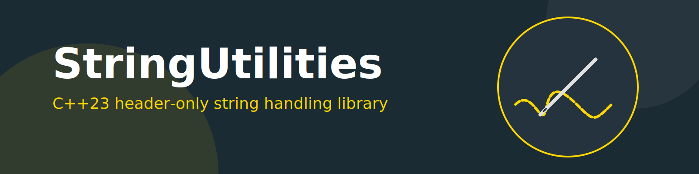

# StringUtilities

`StringUtilities` is a header-only C++23 utility library for string handling and stream-friendly formatting of values and STL containers.

## What this repository provides

- String helpers in `include/stringutil.h`:
  - `toLower`, `toUpper`
  - `trim`, `trimLeft`, `trimRight`, `strip`
  - `replaceChar`, `replaceCharLeft`, `replaceCharRight`
  - `splitIntoVector`, `splitIntoSet`
  - `scanBoolString`, `classifyNumberString`
- Case-insensitive string and traits in `include/ci_string.h` (`util::ci_string` and variants).
- Generic stream decoration/formatting in `include/decorator.h` and conversion helpers in `include/to_string.h` (`toString`, `toWString`).
- Bracket presets for formatted output in `include/brackets.h`.
- Customizable stream decoration for STL containers and POD types:
  - **Containers**: Vectors, sets, maps, etc., are streamed with customizable brackets and separators.
  - **POD Types**: 
    - `char` types are streamed enclosed in single quotes by default (e.g., `'a'`).
    - `string`-like types are streamed enclosed in double quotes by default (e.g., `"hello"`).
    - Numeric types can be configured for base (dec, hex, oct), width, and precision.
  - **System-wide Configuration**: Use `util::decorator<CharT>::instance()` to globally configure how types are streamed.

## Examples

### Container Streaming

```cpp
#include <dkyb/decorator.h>
#include <vector>
#include <iostream>

int main() {
    std::vector<int> vec = {1, 2, 3};
    // Default output: <1,2,3>
    std::cout << vec << std::endl;

    // Customizing globally
    auto& deco = util::decorator<char>::instance();
    deco.setBracketForKey(util::BracketKey::VECTOR, "[", " | ", "]");
    
    // Custom output: [1 | 2 | 3]
    std::cout << vec << std::endl;
}
```

### POD Type Formatting

```cpp
#include <dkyb/decorator.h>
#include <iostream>

int main() {
    char c = 'z';
    std::string s = "Zencoder";
    
    // Default: 'z' and "Zencoder"
    util::decorate(std::cout, c);
    std::cout << " ";
    util::decorate(std::cout, s);
    std::cout << std::endl;

    // Configure integer formatting (char is treated as int if configured)
    auto& deco = util::decorator<char>::instance();
    deco.setBase<int>(util::IntBase::hexadecimal);
    deco.setShowBase<int>(true);
    
    int val = 255;
    // Output: 0xff
    util::decorate(std::cout, val);
}
```

## Build and test

The project uses CMake and builds tests with GoogleTest.

### 1. Configure

```bash
cmake -S . -B build
```

### 2. Build

```bash
cmake --build build --parallel "$(nproc)"
```

### 3. Run unit tests

```bash
ctest --test-dir build --output-on-failure
```

If your environment does not provide a packaged GoogleTest installation, install/build GoogleTest first and make it discoverable to CMake.

## Install headers

```bash
cmake -S . -B build -DCMAKE_INSTALL_PREFIX=/usr
cmake --build build --parallel "$(nproc)"
sudo cmake --install build
```

Headers are installed under `${CMAKE_INSTALL_PREFIX}/include/dkyb`.

## Recent changes

- Added `cmake-common` as a submodule and migrated root build settings to shared `dkyb_apply_common_settings()`.
- Root `CMakeLists.txt` now includes `CTest` and gates test directory inclusion with `BUILD_TESTING`.
- Expanded unit-test coverage with additional tests for:
  - boolean parsing
  - inclusive substring bounds
  - split edge-cases (empty segments, repeated separators)
  - directional replacement helpers
  - numeric string classification
  
## Powered by
Reduce the smells, keep on top of code-quality. Sonar Qube is run on every push to the `main` branch on GitHub.


[](https://sonarcloud.io/project/overview?id=kingkybel)
